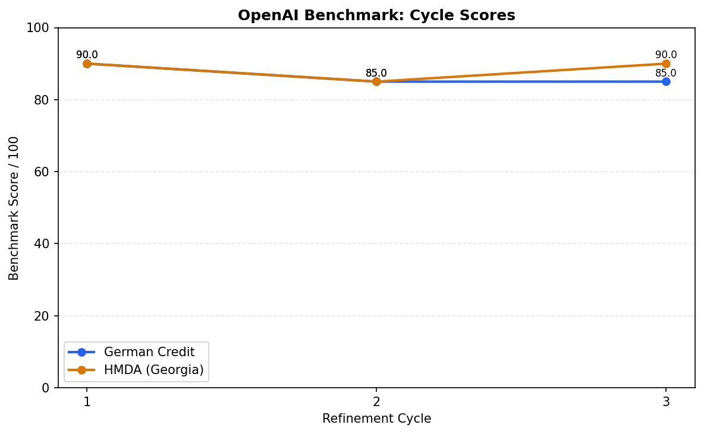
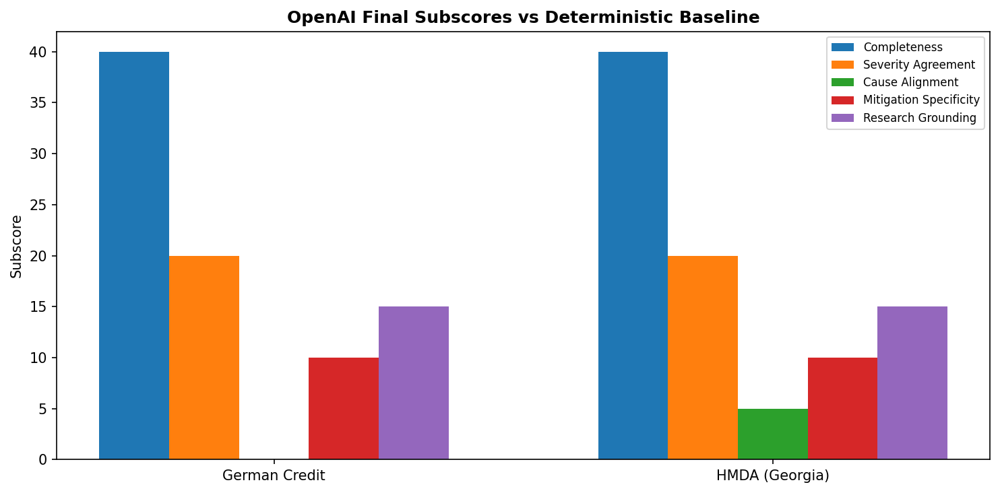
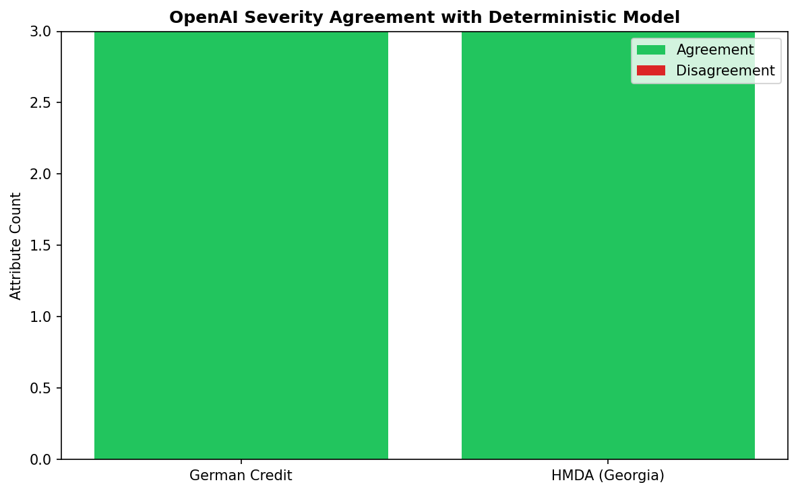
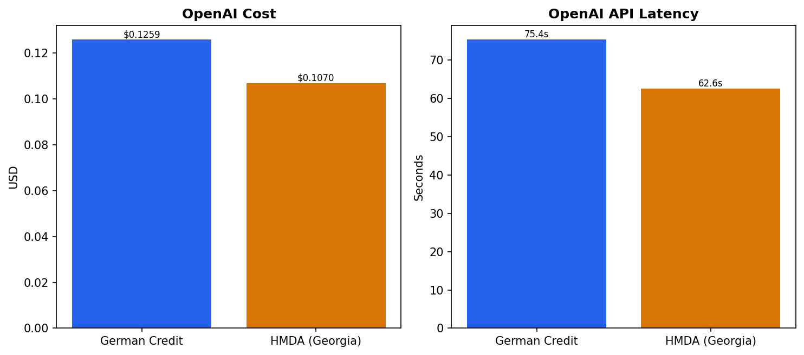
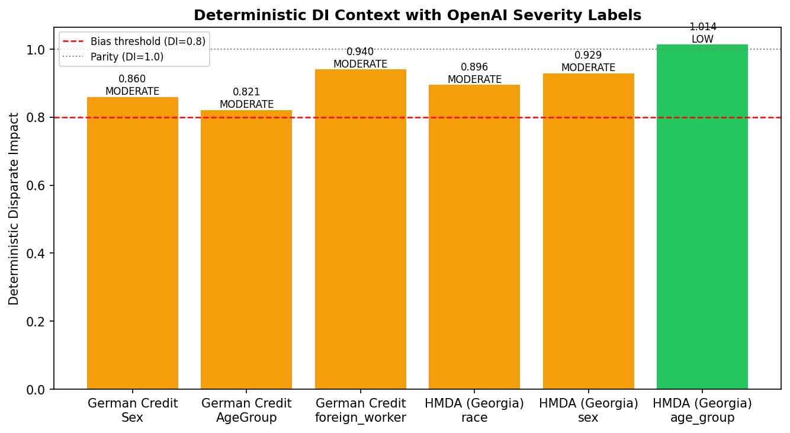

# OpenAI vs Deterministic Model Snapshot

This is a short results snapshot comparing the OpenAI qualitative benchmark against the deterministic fairness model. The deterministic baseline remains the system of record for quantitative metrics, and it now includes Semantic Scholar-backed qualitative evidence and mitigation guidance.

## Summary

| Dataset | Final Score | Cycle Gain | Severity Agreement | Cost (USD) | Latency (s) |
|---|---:|---:|---:|---:|---:|
| German Credit | 85.0 | -5.0 | 3/3 | 0.1259 | 75.4 |
| HMDA Mortgage Lending (Georgia) | 90.0 | +0.0 | 3/3 | 0.1070 | 62.6 |

## Key Takeaways

- The deterministic model remains stronger as the quantitative source of truth and as the audit baseline grounded in Semantic Scholar evidence.
- Self-refinement changed the output meaningfully, but it did not reliably improve final benchmark score; the cycle charts should be treated as an evaluation signal, not assumed progress.
- OpenAI's strongest output is operational mitigation language; our model is stronger on consistency, metric framing, and stable cross-attribute audit structure.

## Visuals

## German Credit

- OpenAI final score: `85.0/100`
- OpenAI cycle gain: `-5.0` points
- Severity agreement with our model: `3/3` attributes
- OpenAI cost: `$0.1259`
- OpenAI API latency: `75.4s`
- Deterministic model research packets: `9` paper entries across attributes

### Deterministic Model

- `Sex_original`: Pre-processing -- Disparate Impact Remover (aif360.algorithms.preprocessing.DisparateImpactRemover): transform feature distributions to reduce correlation with the protected attribute while preserving rank-ordering.
- `AgeGroup_original`: Pre-processing -- Reweighing (aif360.algorithms.preprocessing.Reweighing): assign sample weights that compensate for historical label imbalance across groups before training.

### OpenAI

- `Sex_original`: Priority 1 – Data re-balancing: Apply reweighing to increase the weight of correctly-paid female loans until sex–label mutual information ≈ 0 (Sucharita & Shaw [1]).
- `AgeGroup_original`: Data: Perform stratified bootstrap so that within each age bin the favourable-label share approximates the global mean; keep the effective sample size constant via importance weighting (Rane et al. [2]).

### Read

Keep the deterministic model as the benchmark backbone and quantitative audit record. Use OpenAI as a second-pass qualitative planner that turns the metric findings into prioritised remediation steps.

## HMDA Mortgage Lending (Georgia)

- OpenAI final score: `90.0/100`
- OpenAI cycle gain: `+0.0` points
- Severity agreement with our model: `3/3` attributes
- OpenAI cost: `$0.1070`
- OpenAI API latency: `62.6s`
- Deterministic model research packets: `9` paper entries across attributes

### Deterministic Model

- `race`: Pre-processing -- Reweighing (aif360.algorithms.preprocessing.Reweighing): assign sample weights that compensate for historical label imbalance across groups before training.
- `sex`: Post-processing -- Calibrated Equalized Odds (aif360.algorithms.postprocessing.CalibratedEqOddsPostprocessing): a minimal intervention that adjusts thresholds to bring DI above the 0.8 threshold while preserving calibration.

### OpenAI

- `race`: Immediate (≤1 quarter):
- `sex`: Run feature-attribution audit; suppress or binarise any feature with |Shap|>0.05 and V ≥ 0.30 with sex.

### Read

Keep the deterministic model as the benchmark backbone and quantitative audit record. Use OpenAI as a second-pass qualitative planner that turns the metric findings into prioritised remediation steps.
