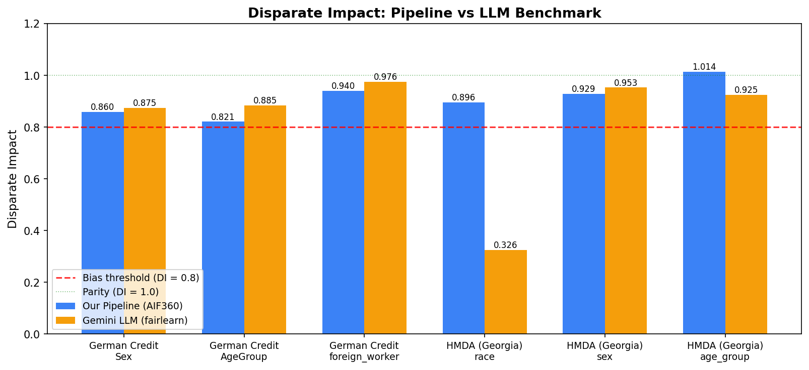
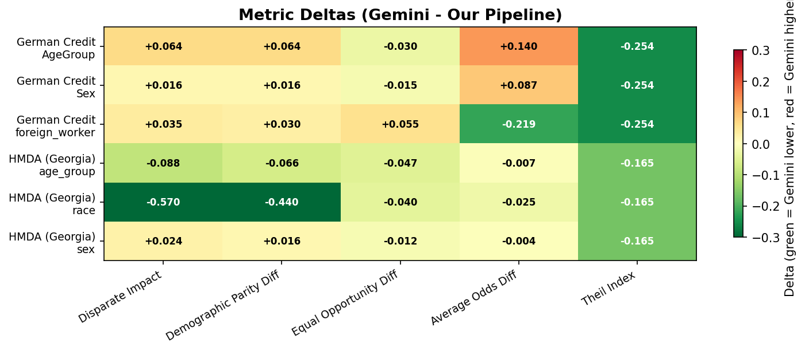
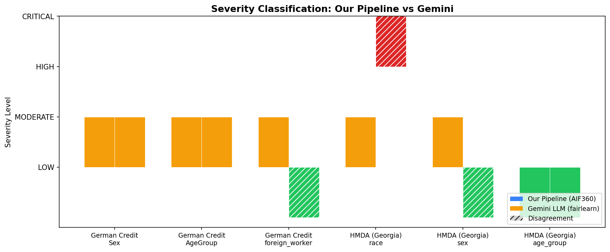
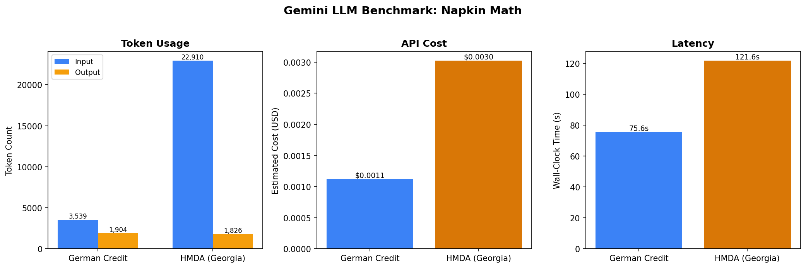

# Team Update: AI Fairness Dashboard

**Date:** February 25, 2026
**Authors:** Siddhant Jain, Ayaan Lalani

---

## What we built

We put together an end-to-end fairness auditing pipeline for lending models. Here's what it does, step by step:

1. **Data cleaning** -- merges raw datasets, extracts protected attributes (sex, age, race, foreign worker status), handles missing values and encoding.
2. **Model training** -- trains Logistic Regression and Random Forest classifiers via scikit-learn with stratified 80/20 splits.
3. **Fairness metrics** -- computes five standard metrics per protected attribute using AIF360: Disparate Impact, Demographic Parity Difference, Equal Opportunity Difference, Average Odds Difference, and Theil Index.
4. **Qualitative analysis** -- a rule-based engine that goes beyond the numbers: it identifies data imbalances, detects proxy features (e.g., Housing correlating with Sex), traces root causes, and recommends specific AIF360 mitigation algorithms.
5. **LLM benchmark** -- we sent the raw prediction data to Google's Gemini 2.5 Flash and asked it to independently compute the same metrics using only fairlearn definitions, plus produce its own qualitative analysis. Zero access to our pre-computed results.
6. **Visualizations** -- generated comparison charts (bar charts, heatmaps, severity plots, cost breakdowns) to make the benchmark differences easy to see.

Everything is orchestrated by `run_pipeline.py`, which runs all steps for each dataset and consolidates outputs into the `artifacts/` directory.

## Datasets

- **German Credit** (UCI Statlog) -- 1,000 consumer credit records with 3 protected attributes: Sex, AgeGroup (under 40 / 40+), and Foreign Worker status. 70% favorable base rate.
- **HMDA Georgia** (Home Mortgage Disclosure Act, 2022) -- 6,525 mortgage applications with 3 protected attributes: Race (6 groups), Sex, and Age Group. 72% approval rate.

## Key results

### German Credit
- All three attributes show **Moderate** bias (DI between 0.82 and 0.94).
- **Sex**: females get favorable outcomes 70.5% of the time vs. 82.0% for males. The `Sex` column itself is a perfect proxy (r=1.0), and Housing and Age also leak information.
- **AgeGroup**: under-40 borrowers are disadvantaged (DI = 0.82). Age is an obvious strong proxy (r = -0.84), and the ground-truth labels themselves embed historical age discrimination (77.5% vs 65.9% favorable base rates).
- **Foreign Worker**: looks moderate on paper (DI = 0.94), but the non-foreign group has only 6 records out of 200 test samples. Those metrics are basically noise -- our pipeline flags this explicitly.

### HMDA
- **Race**: Moderate bias (DI = 0.90). Huge representation imbalance -- White: 1,252 records vs. Pacific Islander: 5. Asian applicants get 79.8% favorable outcomes while Multiracial get 37.5%.
- **Sex**: borderline Moderate (DI = 0.93). Males approved at 73.1% vs. females at 67.9%.
- **Age Group**: effectively fair (DI = 1.01), though historical label bias exists in the ground truth.

## LLM benchmark highlights

We gave Gemini only the raw predictions CSV (ground truth, predicted labels, protected attribute columns) and told it to use fairlearn metric definitions. Here's how it compared:

**Where they agree:**
- German Credit Sex and AgeGroup: both our pipeline and Gemini classify these as Moderate severity. DI values are within ~0.02-0.06 of each other. Directional agreement on all metrics.

**Where they diverge:**
- **HMDA Race** is the big one. Our pipeline says DI = 0.90 (Moderate); Gemini says DI = 0.33 (Critical). Why? Gemini picked American Indian (n=10) as the single unprivileged group and computed DI against that tiny sample. Our pipeline uses a weighted average across all unprivileged groups (AIF360 convention). With only 10 records, that 0.33 number is statistically meaningless -- but Gemini has no concept of sample-size reliability.
- **Foreign Worker**: we say Moderate, Gemini says Low. The 6-person group makes this a coin flip either way.
- **HMDA Sex**: we say Moderate, Gemini says Low. Small difference in DI threshold interpretation.

**Severity agreement: 4 out of 6** attribute-dataset pairs.

**Cost:** The entire LLM benchmark for both datasets cost **$0.004** total. ~26K input tokens, ~3.7K output tokens, about 3 minutes of wall-clock time. Economically trivial.

## Takeaways

1. **Deterministic pipeline is more trustworthy for edge cases** -- it flags small groups, warns about statistical unreliability, and handles multi-group attributes correctly. The LLM doesn't do any of this.
2. **LLM produces richer narrative** -- Gemini identified context-specific issues like zip-code-as-proxy for race in mortgage lending that our rule engine can't catch. Its explanations read more naturally.
3. **LLM mitigations are generic** -- it repeats the same fairlearn recommendations (ExponentiatedGradient, ThresholdOptimizer) for every attribute. Our pipeline tailors recommendations based on detected root causes.
4. **Both approaches are cheap and fast enough to run on every model update.** The deterministic pipeline takes under a second; the LLM adds ~3 minutes and half a cent.

## What's next

- **More lending datasets** -- peer-to-peer lending and credit bureau data to test how well the pipeline generalizes.
- **Intersectional fairness** -- analyze compound groups (e.g., race x sex) to find bias invisible at single-attribute level.
- **Actually implement mitigations** -- run the recommended AIF360/fairlearn algorithms (Reweighing, ExponentiatedGradient, ThresholdOptimizer) and measure the accuracy-fairness tradeoff.
- **Longitudinal monitoring** -- track metric drift over time to catch emerging bias early.
